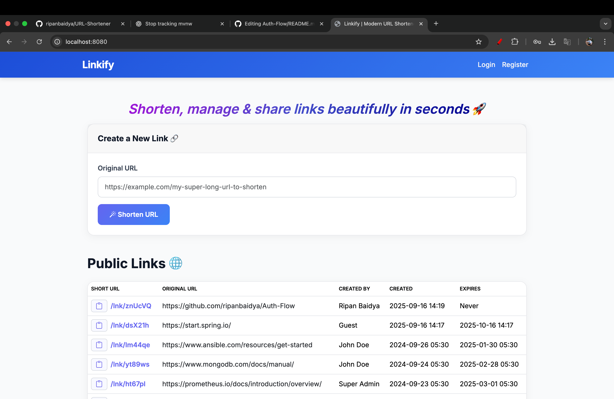
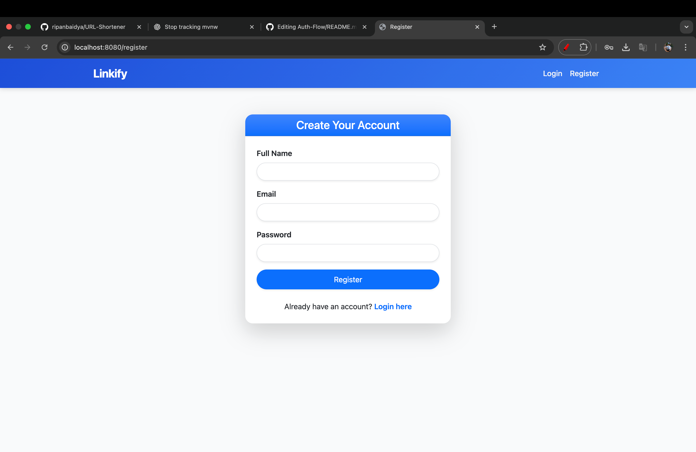
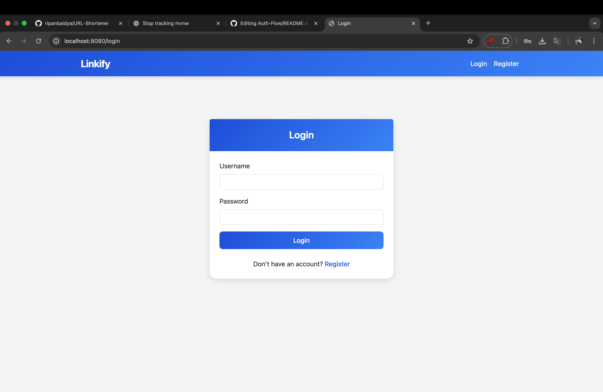
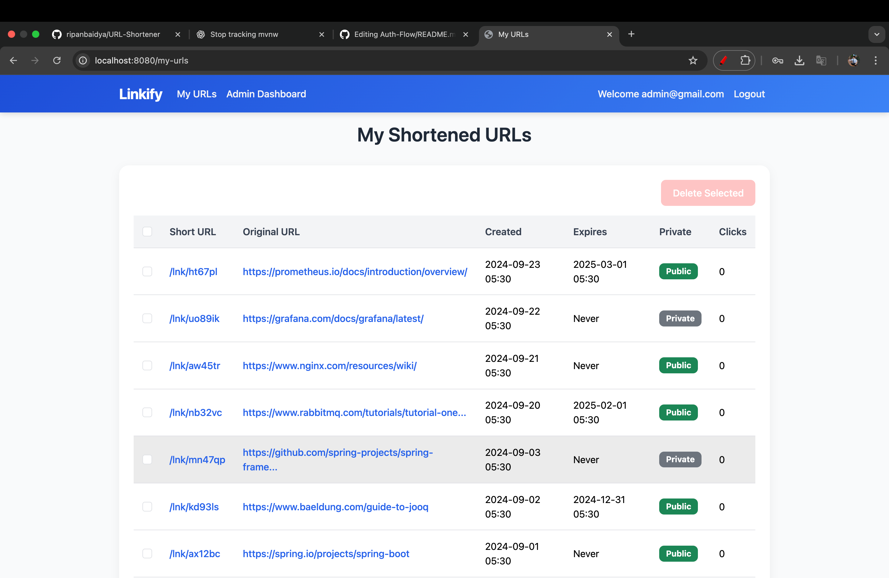
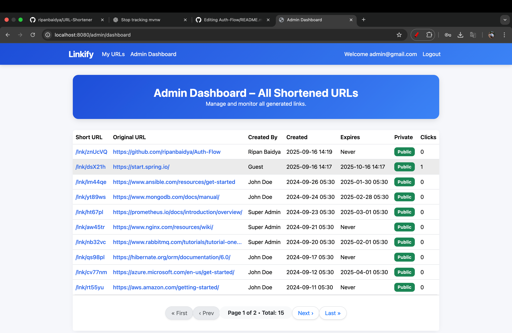

## URL Shortner (Linkify)

A **simple URL Shortener application** built with Spring Boot and Thymeleaf.
Users can shorten long URLs and manage them through a simple web interface.
---

## ✨ Features
- **User Authentication** – Register and log in to manage your own URLs.
- **URL Shortening** – Convert long URLs into short, easy-to-share links.
- **Redirection** – Access the original website instantly by visiting the short link.
- **URL Management** – View a list of all your shortened URLs.
- **Quick Copy** – Copy short links with a single click.
- **Admin Dashboard** – Manage users and monitor activity.
- **Analytics** – Track click counts for each short link.
- **Expiration Dates** – Set an expiry time for links.
- **Pure MVC Architecture** – Built using Spring Boot + Thymeleaf, without REST APIs.

---

### 🛠️ Tech Stack

* **Backend**: Spring Boot (Web, Security, Data JPA, Lombok)
* **Frontend** HTML, CSS/BootStrap, JS, Thymeleaf
* **Database**: PostgreSQL (via Docker Compose)
* **Security**: Spring Security
* **Build Tool:** Maven
---

### ✅ Prerequisites
- Java 21+ (or whichever you used)
- Maven
- Any IDE (IntelliJ, Eclipse, VS Code)
- Docker Desktop

### 🚀 Setup

1. Clone the repo:

   ```bash
   git clone https://github.com/ripanbaidya/URL-Shortener.git
   ```
2. Open in your IDE (IntelliJ / Eclipse).
3. Configure environment variables (for `docker-compose` and `application.yml`).
4. Install Docker if not already installed → [Download Docker](https://www.docker.com/products/docker-desktop).
5. Start PostgreSQL with Docker:

   ```bash
   docker compose up -d
   ```
6. Run the Spring Boot app (`./mvnw spring-boot:run` or via IDE).
7. Open your browser and Visit: `http://localhost:8080`

---

### 📂 Project Structure 
```markdown
Url-Shortener/
 ├── src/
 │   ├── main/
 │   │   ├── java/com/example/urlshortener/   # Java source code
 │   │   ├── resources/
 │   │   │   ├── templates/                  # Thymeleaf templates
 │   │   │   ├── static/                     # CSS/JS
 │   │   │   └── application.properties      # Config
 |
 |__ compose.yml                             # docker-compose.yml
 ├── pom.xml                                 # Maven config
 ├── mvnw, mvnw.cmd                          # Maven wrapper
 └── README.md

```

---

### 📸 Screenshots







### 📄 License
This project is licensed under the Apache-2.0 license.

---

### ☝️One Request

If you found this repository helpful, please consider giving it a star 🌟. It's free, and it will motivate me to create more such content.